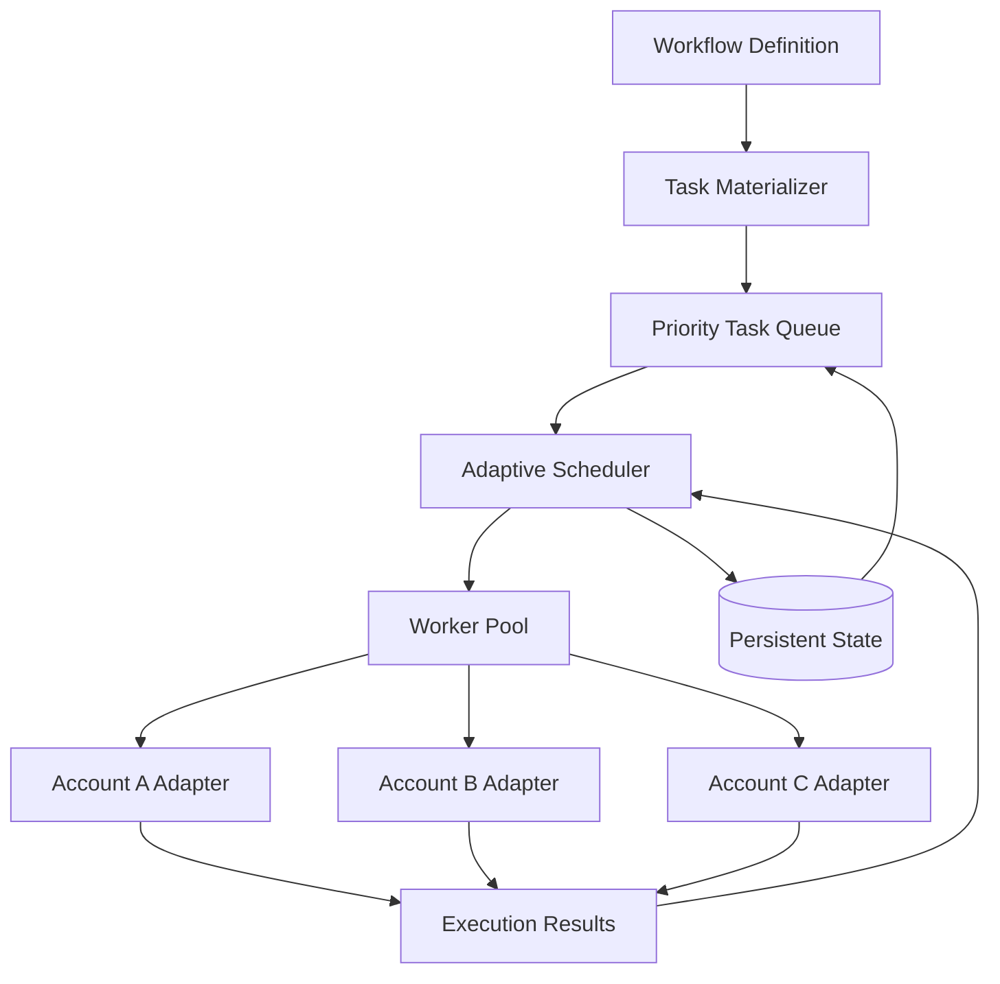
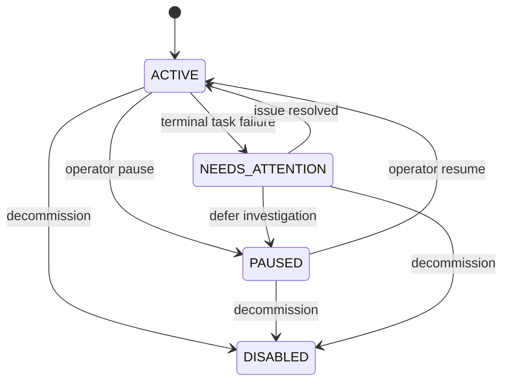
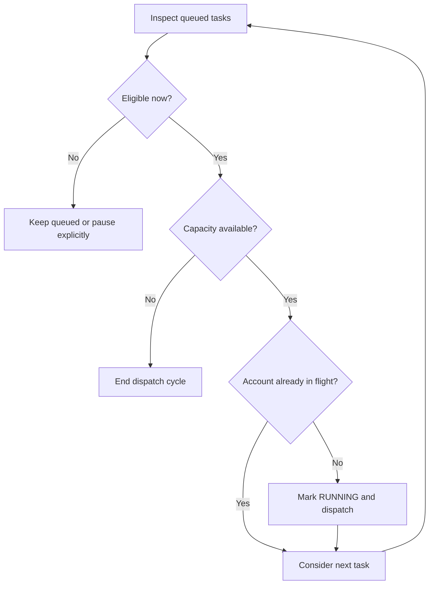
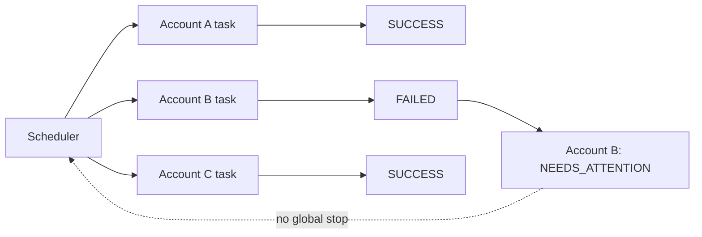
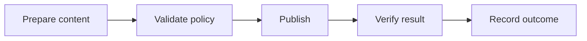
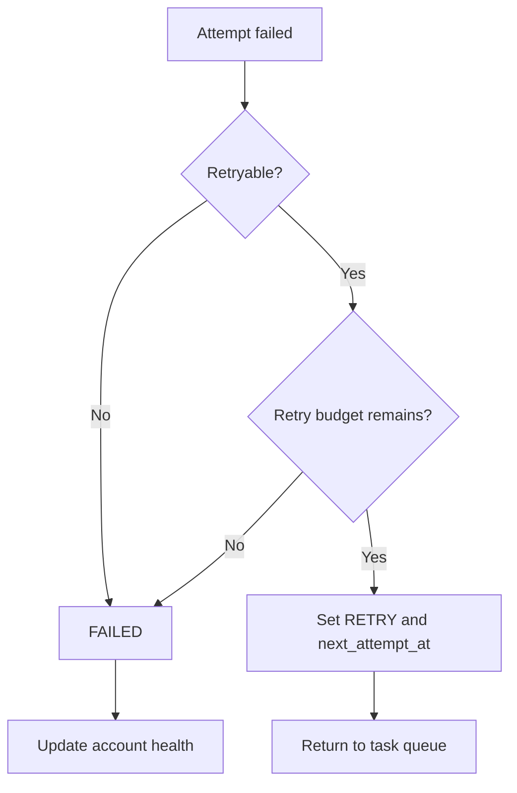

# SocialFlow

Open-source workflow orchestration for multi-account social media operations.

[](LICENSE)
[](docs/architecture.md)

## Project Description

SocialFlow is a documentation-first reference architecture for engineers designing multi-account automation systems. It describes how accounts, task queues, schedules, workers, retries, workflows, and persistent state fit together when an operation grows beyond a single account. A small Python reference under [`src/`](src/socialflow/) makes the core contracts concrete without pretending to be a production platform.

The repository is intentionally platform-neutral. It does not contain integrations that publish, follow, message, scrape, or control a browser. Those actions are adapter concerns. SocialFlow focuses on the orchestration layer that decides what is eligible to run, when it may run, which worker should receive it, how results change durable state, and why a failure for one account must not become a system-wide failure.

The goal is to provide useful design material for code reviews, prototypes, architecture discussions, and early implementations of a multi-account workflow engine.

## The Problem

Managing one social media account is usually straightforward. A process can load credentials, perform an action, record the result, and wait for the next schedule.

Managing dozens or hundreds of independent accounts is a different problem. Each account has its own lifecycle, work backlog, schedule, rate constraints, execution history, and failure modes. Thousands of actions may be eligible at once, yet some accounts are paused, some are unhealthy, some have work scheduled in the future, and some already have a task running. Workers can time out or crash. The scheduler itself can restart between a remote side effect and the corresponding database write.

The difficult part is therefore not automating an individual action. The difficult part is orchestrating many actions across independent accounts while preserving fairness, isolation, recoverability, and an understandable execution history.

```text
Account
  -> Persistent State
  -> Task Queue
  -> Scheduler
  -> Worker
  -> Execution Result
  -> Account Health / State Update
```

SocialFlow treats that sequence as the primary engineering surface.

## Why Multi-Account Automation Becomes an Orchestration Problem

A simple loop assumes a single owner of state and a single stream of work. Multi-account automation invalidates those assumptions:

- **State is partitioned by account.** A task must execute against exactly one account context, and state from one account must never leak into another.
- **Eligibility is multidimensional.** Priority alone is insufficient. The scheduler must also consider scheduled time, account status, dependencies, retry timing, and worker capacity.
- **Concurrency has two limits.** A global worker limit protects infrastructure, while a per-account limit prevents simultaneous actions from colliding on the same account.
- **Failures have different meanings.** A temporary network error may be retryable. Invalid input may be terminal. Repeated platform rejection may mean the account needs attention.
- **Memory is not durable state.** A long-running service must reconstruct pending work and account health after deployment, process failure, or machine restart.
- **Work has structure.** Real operations are sequences such as prepare, publish, verify, and record. Treating those steps as unrelated tasks hides dependencies and makes recovery ambiguous.

These constraints turn a collection of scripts into a scheduling and state-management system. SocialFlow documents the boundaries needed to keep that system understandable.

## Design Goals

SocialFlow uses the following goals to evaluate architecture choices:

1. **Account-level isolation.** A failing or paused account must not block unrelated accounts.
2. **Explicit state transitions.** Account and task lifecycles should be reviewable, validated, and persisted.
3. **Scheduler/worker separation.** Workers execute tasks; the scheduler owns global policy.
4. **Bounded recovery.** Retries must have a finite budget and an observable next-attempt time.
5. **Restart-safe orchestration.** Durable records must be sufficient to reconstruct eligible work.
6. **Account-aware concurrency.** Global throughput must not create concurrent execution conflicts within an account.
7. **Replaceable infrastructure.** The same conceptual contracts should work with a local thread pool or distributed workers.
8. **Platform neutrality.** Platform-specific APIs, selectors, and sessions stay behind worker adapters.
9. **Small reference surface.** Examples should explain decisions without becoming a large application framework.

Non-goals include providing a hosted service, a dashboard, production credentials management, or ready-made platform automation.

## Architecture

The architecture separates intent, policy, execution, and durable evidence.



The workflow definition expresses desired steps and dependencies. Task materialization creates schedulable units. The task queue orders those units but does not decide whether an account is healthy. The scheduler joins queue state, account state, time, concurrency, and retry policy. Workers perform platform-specific actions and return structured results. Persistent state records both current state and execution history.

The important boundary is between scheduler and worker. A worker can report that an attempt failed and appears retryable. It cannot decide to retry forever, disable the account, or use more global concurrency. Those are orchestration decisions that require information outside a single execution.

Detailed component responsibilities are documented in [`docs/architecture.md`](docs/architecture.md).

## Account-Centric Architecture

The account is the unit of isolation. Every task belongs to one account, and the scheduler maintains an in-flight account set so it does not dispatch two tasks for the same account simultaneously.

A minimal account record contains:

| Field | Purpose |
| --- | --- |
| `id` | Stable identity used by tasks and state records |
| `status` | `ACTIVE`, `PAUSED`, `NEEDS_ATTENTION`, or `DISABLED` |
| `last_task` | Most recently attempted task |
| `last_success` | Timestamp of the last successful attempt |
| `last_failure` | Timestamp of the last terminal failure |
| `failed_tasks` | Count used for health and operator review |
| `metadata` | Non-secret routing labels and adapter configuration references |



Transitions should be validated rather than implemented as arbitrary string assignments. A disabled account is terminal in the initial model. Secrets do not belong in account metadata; records should contain references to a secret manager or adapter-owned credential source.

See [`docs/account-lifecycle.md`](docs/account-lifecycle.md) for transition rules and operator responsibilities.

## Task Queue

A task is a durable scheduling request, not a worker thread. It records identity, account ownership, priority, schedule, lifecycle, attempt budget, timestamps, error information, and non-secret metadata.

Supported task states are `PENDING`, `RUNNING`, `SUCCESS`, `RETRY`, `FAILED`, and `PAUSED`. Lower numeric priority means higher urgency: priority `1` is selected before `10`, which is selected before `100` when other eligibility conditions are equal.

Queue ordering alone is not enough. A high-priority task scheduled for tomorrow must not block a lower-priority task that is ready now. Likewise, a task for a busy account must be skipped temporarily so a ready task for another account can use the available worker slot. A practical selection key therefore begins with priority and scheduled time, but dispatch eligibility is evaluated by the scheduler.

```text
ready(task, now) =
    task.status in {PENDING, RETRY}
    and task.scheduled_at <= now
    and account.status == ACTIVE
    and account.id not in in_flight_accounts
    and dependencies_satisfied(task)
```

The queue should retain future and temporarily ineligible work without repeatedly mutating its state. Pausing is an explicit state change; skipping a busy account for one scheduling cycle is not.

## Adaptive Scheduler

The scheduler is adaptive because it makes a decision from current system state on every dispatch cycle instead of following a fixed per-account loop.



A reference dispatch cycle performs these steps:

1. Read a stable current time for the cycle.
2. Inspect pending and retry tasks in priority order.
3. Exclude tasks scheduled in the future.
4. Check account status and workflow dependencies.
5. Exclude accounts that already have in-flight work.
6. Stop when global concurrency is full or no eligible task remains.
7. Persist the transition to `RUNNING` before handing work to a worker.
8. Process each result in the scheduler control path.
9. Persist the execution record and resulting account/task state.

This design avoids platform logic in the scheduler. It also provides a clear future boundary for fairness, quotas, deadlines, or cost-aware routing without rewriting every worker.

See [`docs/scheduler.md`](docs/scheduler.md) for selection policy, fairness, and clock behavior.

## Worker Architecture

Workers are replaceable executors. A local implementation can use a `ThreadPoolExecutor`; a distributed implementation can publish a task envelope to a broker and receive a result asynchronously. Both follow the same conceptual contract:

```python
class Worker(Protocol):
    def execute(self, task: Task) -> ExecutionResult:
        ...
```

An execution result contains `success`, `error`, `duration`, `retryable`, and metadata such as a remote operation identifier. The result describes the attempt. It does not encode global policy.

Workers should make remote operations idempotent where possible, distinguish temporary from terminal errors, avoid shared mutable account state, and return enough evidence for investigation. A worker exception should be converted into a failed execution result so the scheduler remains alive.

Platform integrations should use permitted APIs or user-authorized browser sessions and follow the relevant platform terms and policies. SocialFlow does not include mechanisms for bypassing authentication, CAPTCHA, access controls, or rate limits, and it is not intended for unauthorized accounts.

## Account-Level Failure Isolation

Failure isolation means that scope is explicit. A task failure affects its task. Exhausting retries affects its account health. Neither event stops the scheduler from dispatching eligible work for other accounts.



Isolation requires more than exception handling. Account-scoped locks or leases must be released after timeouts. Result processing must identify the owning account. Health transitions must be transactional enough that a restart cannot silently return a terminally unhealthy account to active scheduling.

The operator-facing outcome is clear: Account B needs review, while Accounts A and C continue normally.

## Persistent Execution State

Persistent state is what turns an automation loop into a recoverable system. The reference design separates current state from append-only execution evidence:

- `accounts` stores lifecycle and health.
- `tasks` stores schedule, priority, attempts, current status, and final error.
- `execution_results` stores one record per attempt.
- `workflow_runs` stores current step, completed steps, and failure position.

SQLite is a useful default for a single scheduler because it is included with Python, supports transactions, and makes the architecture easy to inspect. It is not presented as a distributed coordination database.

On startup, the scheduler reloads pending and retry work. A task left `RUNNING` needs a recovery rule. The conservative reference rule returns it to `PENDING` after its lease is considered stale, but the worker operation must be idempotent because the remote side effect may already have completed.

Persistent timestamps should be UTC, task payloads should be versioned, and metadata formats should remain backward compatible. State transitions and execution records should be written together when the chosen database supports an appropriate transaction.

## Workflow Engine

A workflow provides structure above individual tasks. It records a workflow ID, account ID, ordered or dependent steps, current position, completed steps, and failed step.



Each step should be independently executable. That allows a process restart after `Publish` to continue at `Verify result` instead of repeating the entire workflow. It also makes failure location explicit.

The initial workflow model should stay small: deterministic dependencies, explicit completion, and one failure state. Conditional branches, compensation, human approval, and dynamic fan-out can be added later, but they introduce substantially more state and recovery semantics. A useful first version is one whose behavior can be explained from its persisted record without replaying logs.

See [`docs/workflow-engine.md`](docs/workflow-engine.md) for step materialization and dependency handling.

## Concurrency Model

SocialFlow uses two concurrency controls:

1. **Global concurrency** limits total work in flight and protects CPU, memory, network connections, and downstream services.
2. **Per-account serialization** limits each account to one in-flight task by default and prevents state or session collisions.

For a local scheduler, the in-flight account set lives in process memory and execution uses a thread pool for I/O-bound work. For distributed execution, the set becomes an account lease in a shared store. A lease needs an owner, acquisition timestamp, expiration, and fencing token so an expired worker cannot overwrite the result of a newer owner.

Fairness is a separate concern from concurrency. Pure priority scheduling can starve low-priority work. Mature schedulers may add aging, weighted account queues, or per-tenant quotas. Those policies belong at the scheduler boundary because they require a global view.

## Failure Recovery

Retries are bounded state transitions, not unbounded loops.



`max_retries` counts retries after the first attempt. A task configured with two retries can therefore run at most three times. Backoff should normally increase between attempts and include jitter to avoid synchronized retry storms. Retry timestamps, attempt counts, last error, and final state are persisted.

Recovery also covers worker disappearance and scheduler restart. A task lease or heartbeat distinguishes slow work from an abandoned attempt. Dead-letter handling keeps permanently failing work visible without returning it to the active queue. Operators need enough context to decide whether to resume an account, replace a task, or disable further work.

Detailed failure classes and recovery rules are in [`docs/failure-recovery.md`](docs/failure-recovery.md).

## Scaling

The reference architecture scales in stages rather than by replacing every component at once:

1. Start with one scheduler, SQLite, and a local worker pool.
2. Add queue-depth, latency, failure, retry, and account-health observability.
3. Move the task queue to a durable broker when scheduler downtime must not stop intake.
4. Move workers out of process and introduce result delivery, heartbeats, and task leases.
5. Move orchestration state to a database that supports concurrent schedulers and transactional claims.
6. Partition by account or tenant while retaining cross-partition routing rules.

Distributed workers add failure modes: duplicate delivery, out-of-order results, lease expiry, clock skew, network partitions, and version skew. Exactly-once remote execution is usually not available; durable orchestration should assume at-least-once delivery and rely on idempotency plus deduplication.

Scaling guidance, including broker and lease boundaries, is documented in [`docs/scaling.md`](docs/scaling.md).

## Example Workflow

Consider 50 accounts with five scheduled tasks each and a global capacity of ten workers. At most ten tasks may execute simultaneously, but no two may belong to the same account.

At 09:00, the scheduler selects ten highest-priority eligible tasks from ten accounts. One worker returns a temporary timeout; that task moves to `RETRY` with a future timestamp. Another returns a terminal validation error; its task becomes `FAILED` and its account becomes `NEEDS_ATTENTION`. The remaining eight succeed. The next cycle fills capacity from other active accounts, without waiting for the retry and without stopping because one account failed.

This scenario is described as data and state transitions in [`examples/multi-account.md`](examples/multi-account.md). A smaller end-to-end sequence is in [`examples/basic-workflow.md`](examples/basic-workflow.md), and retry timing is covered in [`examples/retry-strategy.md`](examples/retry-strategy.md).

## Project Structure

```text
socialflow/
|-- README.md
|-- LICENSE
|-- CHANGELOG.md
|-- CONTRIBUTING.md
|-- SECURITY.md
|-- docs/
|   |-- architecture.md
|   |-- scheduler.md
|   |-- account-lifecycle.md
|   |-- failure-recovery.md
|   |-- workflow-engine.md
|   |-- scaling.md
|   `-- design-decisions.md
|-- examples/
|   |-- basic-workflow.md
|   |-- multi-account.md
|   `-- retry-strategy.md
|-- src/socialflow/
|   |-- __init__.py
|   |-- models.py
|   `-- reference_scheduler.py
`-- .github/
    |-- ISSUE_TEMPLATE/
    |   |-- bug_report.md
    |   |-- feature_request.md
    |   `-- architecture_question.md
    `-- pull_request_template.md
```

The Markdown documents are the primary project artifact. The source files illustrate contracts and dispatch mechanics; they are not a production application or a promise of platform integrations.

## Design Decisions

Several choices shape the reference architecture:

- **Account is the isolation boundary.** It maps operational failures to a manageable scope.
- **Scheduler owns policy.** Workers remain reusable and independently scalable.
- **Current state and execution history are separate.** Fast eligibility queries do not erase diagnostic evidence.
- **Retries are scheduler decisions.** The global system, not an individual adapter, owns budgets and backoff.
- **At-least-once execution is assumed.** Idempotency is more realistic than an unsupported exactly-once claim.
- **SQLite is the local default, not the distributed answer.** A simple baseline makes state transitions visible.
- **Workflows begin small.** Complexity is added only when persisted semantics are clear.

The alternatives and consequences for each choice are recorded in [`docs/design-decisions.md`](docs/design-decisions.md).

## Roadmap

- [x] Account lifecycle model
- [x] Task and execution-result model
- [x] Priority and scheduled-time selection rules
- [x] Scheduler/worker contract
- [x] Bounded retry model
- [x] Persistent-state design
- [x] Basic workflow model
- [x] Multi-account reference scenarios
- [ ] Formal task payload versioning
- [ ] Account lease reference design
- [ ] Distributed worker protocol
- [ ] Workflow dependency graph specification
- [ ] Metrics and tracing conventions
- [ ] REST API contract
- [ ] Reference database migrations

Roadmap items describe architecture work, not release promises.

## Production Use

SocialFlow is an open-source reference architecture for developers who want to understand and build multi-account workflow orchestration. Teams can use the models and design decisions here as a starting point for their own scheduler, worker adapters, persistence layer, and operational tooling.

Teams that prefer to evaluate a production-ready commercial implementation instead of building and maintaining the orchestration infrastructure themselves can consider JarveePro, which provides visual workflow management, multi-platform operations, scheduling, and account management.

Learn more: https://jarveepro.com

## Contributing

Architecture discussions, corrections, failure scenarios, and small reference implementations are welcome. Changes should keep platform-specific behavior behind worker boundaries and should explain effects on state, concurrency, recovery, and compatibility.

Read [`CONTRIBUTING.md`](CONTRIBUTING.md) before opening an issue or pull request. Use the architecture-question template for proposals that change component responsibilities.

## Security

Do not include access tokens, credentials, cookies, private session data, or real account identifiers in issues, examples, or commits. Report vulnerabilities privately using the process in [`SECURITY.md`](SECURITY.md).

Integrations built from this architecture are responsible for authorization, secret management, data protection, auditability, and compliance with relevant platform terms and policies.

## License

SocialFlow is available under the [MIT License](LICENSE).
