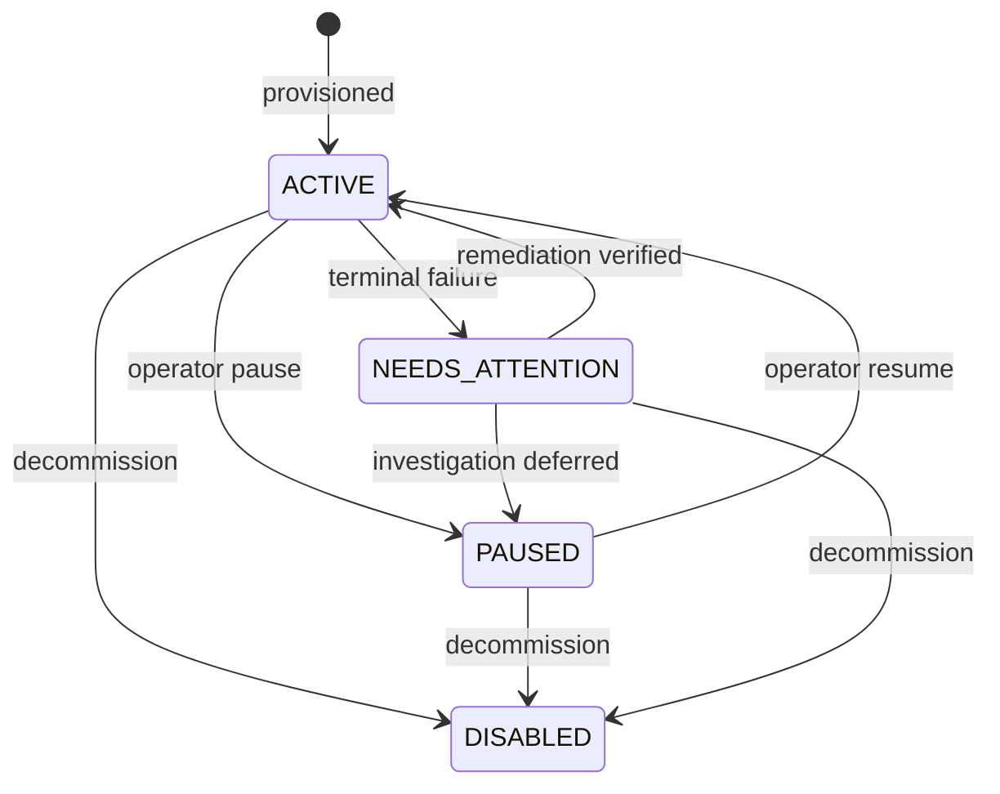

# Account Lifecycle

The account is SocialFlow's primary isolation boundary. Lifecycle state answers a simple operational question: may the scheduler dispatch work for this account now?

## States

| State | Meaning | Scheduler behavior |
| --- | --- | --- |
| `ACTIVE` | Healthy and enabled | May dispatch eligible tasks |
| `PAUSED` | Intentionally stopped | Retain or pause work; do not dispatch |
| `NEEDS_ATTENTION` | Terminal failure requires review | Do not dispatch until resolved |
| `DISABLED` | Decommissioned | Never dispatch; terminal state |



## Why Explicit Transitions Matter

If status is an arbitrary string field, application code can accidentally reactivate a disabled account or bypass the review required after a final failure. A transition function should validate the source and destination, record who or what initiated the transition, and persist a timestamp and reason.

An account-status history might contain:

```json
{
  "account_id": "account-017",
  "from": "active",
  "to": "needs_attention",
  "reason": "task retry budget exhausted",
  "task_id": "task-8a1",
  "changed_at": "2026-08-31T09:14:22Z"
}
```

This record is operational evidence. It should not contain credentials, session data, or unnecessary platform response bodies.

## Task Interaction

Tasks and accounts have separate lifecycles. Pausing an account does not mean that all its tasks failed. Depending on the product policy, pending tasks can remain `PENDING` but ineligible, or transition to `PAUSED` to make the effect explicit. The policy must be consistent because resume behavior depends on it.

A task already running when an operator pauses an account needs a defined rule. Common choices are:

- allow the current attempt to finish and prevent new dispatch;
- request cooperative cancellation and record whether it was honored; or
- terminate the worker and recover the task from its lease.

Allowing completion is the simplest default for short operations. Forced termination creates uncertainty around remote side effects.

## Health Signals

`last_success`, `last_failure`, and `failed_tasks` provide a small health summary. They should not replace execution history. Health policy may consider:

- consecutive terminal failures;
- time since last successful task;
- repeated authentication or authorization failures;
- adapter reports that require human review; and
- operator-defined maintenance windows.

Transient errors that remain within retry budget normally do not change account health. Otherwise, temporary network instability could pause a large fraction of accounts at once.

## Recovery From NEEDS_ATTENTION

Resume should be an explicit operator or policy action. Before returning to `ACTIVE`, a system may require:

1. the underlying issue to be classified;
2. credential or configuration remediation outside task metadata;
3. a health check using a permitted platform interface;
4. a decision about failed and paused tasks; and
5. an audit reason for reactivation.

Reactivation should not silently reset attempt counts or erase errors. Operators need to choose whether to retry the failed task, replace it with a corrected task, or leave it terminal.

## Metadata and Secrets

Account metadata is useful for region, tenant, adapter type, routing pool, or labels. Store secret references rather than secret values. The worker resolves those references at execution time using a secret manager and receives only the minimum scope needed for the task.

This separation reduces accidental exposure in queue payloads, logs, issue reports, and database exports.
