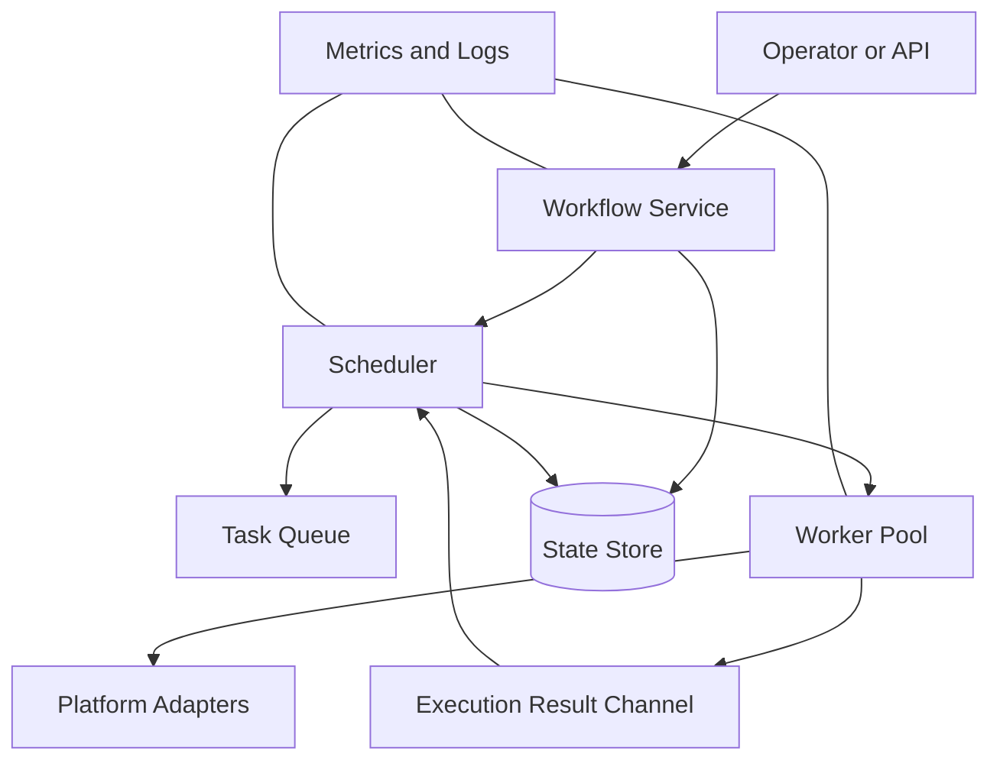
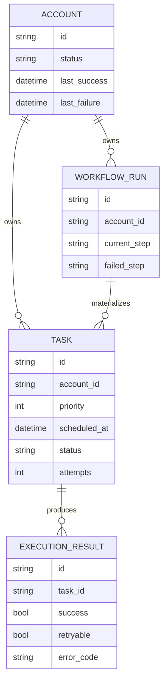
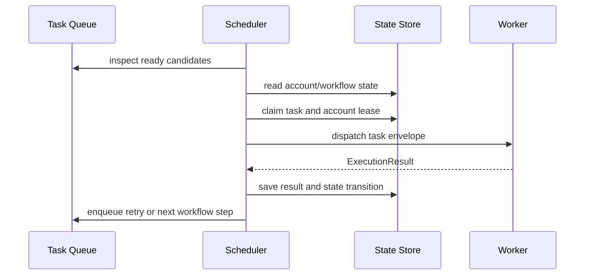

# Architecture

SocialFlow is a reference architecture for the orchestration layer of a multi-account automation system. It deliberately separates workflow intent, scheduling policy, execution adapters, and durable state.

## System Context

The operator or an upstream API creates workflow intent. The workflow service validates definitions and materializes task records. The scheduler selects eligible tasks. Workers execute through platform adapters and report structured results. The state store is the source of truth for account health, task state, workflow progress, and execution history.

Observability is shown as a cross-cutting concern. Logs are useful evidence, but they are not the authoritative current state. A system should be able to explain why a task is or is not eligible from durable records.

## Component Responsibilities

### Workflow Service

- validates step IDs and dependencies;
- creates workflow-run state for one account;
- materializes a task when a step becomes ready;
- marks completed and failed steps from task outcomes; and
- prevents a workflow from advancing past unmet dependencies.

### Task Queue

- orders candidate work by priority and schedule;
- retains future work without blocking ready work;
- exposes enough candidates for the scheduler to apply account constraints; and
- does not own account health or retry policy.

### Scheduler

- joins tasks with account and workflow state;
- enforces global concurrency and per-account serialization;
- persists claims before dispatch;
- applies retry and account-health policies to results; and
- makes dispatch decisions without platform-specific execution code.

### Worker

- resolves the correct adapter and account context;
- executes one task attempt;
- measures duration and captures remote identifiers;
- classifies a failure as potentially retryable or terminal; and
- never changes global queue, concurrency, or retry policy directly.

### State Store

- provides durable current-state records;
- preserves an execution record for every attempt;
- supports atomic claims in multi-scheduler deployments; and
- exposes recovery queries for stale running work.

## Core Records

Current-state tables answer eligibility queries. Execution-result records answer historical questions. Keeping them separate avoids overwriting the evidence needed to understand repeated failures.

## Control Flow

Persisting a claim before dispatch closes an important recovery gap. A crash after claim but before execution leaves a stale lease that can be recovered. A crash after a remote side effect but before result persistence still requires worker idempotency; orchestration cannot prove that an external system did nothing.

## Architectural Invariants

1. A task belongs to exactly one account.
2. A task attempt has at most one active owner.
3. An account has at most one active execution lease by default.
4. Every worker attempt produces an execution result or becomes recoverable as a stale lease.
5. Retry count is bounded and persisted.
6. Terminal failure changes only the owning account's health.
7. Platform-specific code cannot mutate scheduler-global state.
8. Secrets are referenced, never embedded in tasks or account metadata.

## Deployment Shapes

The smallest deployment keeps queue, scheduler, worker pool, and SQLite store in one process. This is useful for learning and prototypes. A larger deployment separates workers first, then moves the queue and state store to durable services. The contracts remain stable while transport and coordination mechanisms change.

See [Scaling](scaling.md) for the migration path and [Design Decisions](design-decisions.md) for alternatives considered.
