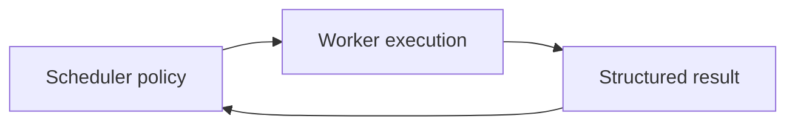

# Design Decisions

This document records the decisions that shape SocialFlow. Each entry states the choice, the main alternatives, and consequences. It is an architecture record, not a claim that the choice is universally correct.

## DD-001: Account as the Isolation Boundary

**Decision:** Tasks, leases, health, and execution history are scoped to an account.

**Alternatives:** one global queue with no account ownership; workflow-only isolation; worker-process isolation.

**Consequences:** failures map cleanly to an operational unit and per-account serialization is expressible. Cross-account workflows need a coordinator rather than a shared account lock.

## DD-002: Scheduler Owns Policy

**Decision:** Priority, eligibility, concurrency, retry, and account-health changes belong to the scheduler. Workers return attempt results.

**Alternatives:** workers requeue themselves; each adapter has its own scheduler; workflow steps call platform code directly.

**Consequences:** global policy is consistent and testable. Execution results must be expressive enough for the scheduler to classify outcomes without importing platform code.

## DD-003: Current State Plus Append-Only Attempt History

**Decision:** Account, task, and workflow records store current state; every attempt creates a separate execution result.

**Alternatives:** overwrite one task record; reconstruct state entirely from events; rely on logs.

**Consequences:** eligibility queries remain simple and attempt history remains available. Writes may need a transaction to keep current state and history consistent. A full event-sourced model remains possible but is not required for the initial reference.

## DD-004: Bounded Scheduler-Managed Retry

**Decision:** Every task has a finite retry budget. The scheduler computes the next attempt time.

**Alternatives:** infinite worker loops; adapter-specific retry queues; operator-only redrive.

**Consequences:** retry storms and permanently stuck tasks are bounded. Adapters still classify retryability and may provide retry hints. Operators need dead-letter visibility for exhausted work.

## DD-005: Per-Account Serialization by Default

**Decision:** Only one task per account is in flight unless a future account policy explicitly allows more.

**Alternatives:** global limit only; per-task-type locks; optimistic concurrent execution.

**Consequences:** account session and state collisions are reduced. Throughput for one account is intentionally limited, while fleet throughput comes from parallelism across accounts.

## DD-006: At-Least-Once Execution Assumption

**Decision:** Distributed task delivery and crash recovery may cause duplicate attempts. Adapters should use idempotency and deduplication.

**Alternatives:** claim exactly-once execution; never retry uncertain work; distributed transactions with every remote platform.

**Consequences:** the design reflects real network boundaries and does not make an unsupported guarantee. Some integrations may have uncertain outcomes that require reconciliation.

## DD-007: SQLite as the Local Reference Store

**Decision:** SQLite is the conceptual default for a single scheduler, while the documentation defines the requirements for a distributed store.

**Alternatives:** require a server database from the start; in-memory state only; store tasks as files.

**Consequences:** the local model is easy to inspect and deploy. SQLite is not treated as a distributed lease manager, and multi-scheduler deployments must replace or extend the persistence boundary.

## DD-008: Workflow Definitions Are Versioned

**Decision:** Active workflow runs remain attached to an immutable definition version.

**Alternatives:** edit definitions in place; serialize executable code into every run; require all runs to finish before edits.

**Consequences:** recovery semantics remain understandable during deployments. Migration between versions becomes an explicit, audited operation.

## DD-009: Platform-Neutral Core

**Decision:** Platform actions live behind worker adapters and are not included in the reference architecture.

**Alternatives:** build platform clients into task models; one repository per platform; scheduler branches on platform names.

**Consequences:** orchestration concepts remain reusable and security-sensitive integrations are separated. Adapter contracts must be designed carefully so platform differences do not leak into scheduler policy.

## DD-010: Documentation Is the Primary Artifact

**Decision:** SocialFlow prioritizes technical documentation and small reference code over a feature-complete local application.

**Alternatives:** ship a hosted service; build a broad framework before documenting it; publish diagrams without concrete contracts.

**Consequences:** the repository is useful for design and learning without implying production readiness. Reference code is intentionally incomplete and must be evaluated before use in a real system.

## Proposing a Change

Open an architecture question using the repository template. Describe the constraint, affected invariant, alternatives, persistence impact, failure behavior, and migration path. A design change should update this document when it alters a recorded decision.
