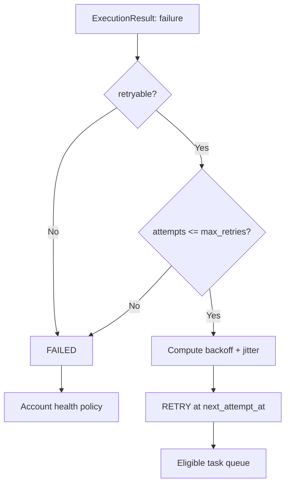

# Failure Recovery

Failure recovery is the combination of classification, bounded retry, durable state, idempotency, and operator visibility. Catching exceptions is only the first step.

## Failure Classes

| Class | Example | Typical action |
| --- | --- | --- |
| Transient transport | timeout, connection reset | Retry with backoff |
| Capacity | temporary upstream overload | Retry with longer backoff |
| Invalid task | missing or malformed input | Fail without retry |
| Authorization | permission rejected | Fail and review account |
| Worker crash | process exits during task | Recover after lease expiry |
| Scheduler crash | result not persisted | Reconcile task and remote side effect |
| Dependency failure | required workflow step failed | Block dependent steps |

Adapters provide a local classification, but the scheduler owns the final decision because it knows attempt budget and account policy.

## Bounded Retry



`max_retries` counts retries after the initial attempt. Persist both `attempts` and `next_attempt_at`; do not recreate retry state only from logs.

A common backoff is:

```text
delay = min(max_delay, base_delay * 2^(attempt - 1)) + random_jitter
```

Jitter prevents many tasks that failed together from retrying at exactly the same time. A retry-after value from a permitted upstream API may override the local backoff if policy allows.

## Idempotency

The scheduler cannot guarantee exactly-once side effects across a network. Consider this sequence:

1. a worker sends a remote request;
2. the remote system accepts it;
3. the worker crashes before saving success; and
4. the task lease expires and the scheduler retries.

The retry may duplicate the action unless the adapter uses an idempotency key or can query the remote operation by a stable correlation ID. Task IDs are good idempotency-key candidates when one task represents one intended remote effect.

If a platform has no idempotency facility, the adapter should record enough evidence to reconcile uncertain outcomes. The system must communicate uncertainty rather than claiming exactly-once behavior.

## Lease Recovery

A distributed worker owns a task only until its lease expires. A recovery process identifies tasks where:

```text
status = RUNNING and lease_expires_at < now
```

It records the abandoned attempt, releases the account lease, and applies retry policy. Heartbeats may extend a lease for legitimate long-running work, but a maximum execution deadline prevents an unhealthy worker from renewing forever.

Fencing tokens protect against late results. Result persistence checks that the token matches the current task owner. A result from an expired owner is retained as diagnostic evidence but must not overwrite newer state.

## Scheduler Restart

At startup, the scheduler:

1. loads active account and workflow state;
2. reloads pending and retry tasks;
3. identifies stale running leases;
4. reconciles or recovers abandoned attempts; and
5. resumes normal selection.

A single-process SQLite prototype can normalize stale `RUNNING` tasks to `PENDING` at startup. A production design should first record why the attempt was abandoned and consider remote reconciliation.

## Dead-Letter Handling

Terminal tasks remain queryable but are excluded from active selection. A dead-letter view should include account, workflow, attempts, failure category, last error, timestamps, and correlation IDs. Redrive is an explicit operation that creates a new attempt or replacement task without erasing the original evidence.

## Failure Isolation

A final failure updates only its task, workflow step, and owning account. The scheduler continues processing other active accounts. Global stop conditions should be reserved for systemic risks such as corrupted state, unavailable persistence, or an operator emergency stop.

This distinction prevents one malformed task or unhealthy account from turning into a fleet-wide outage.
