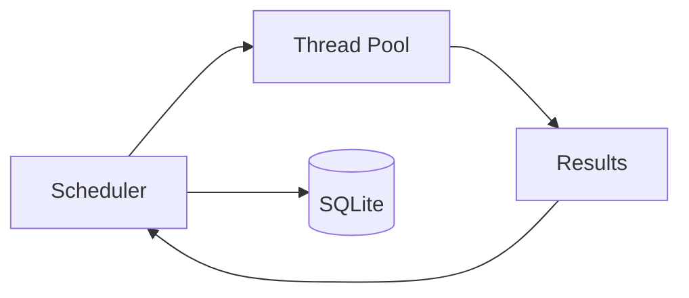
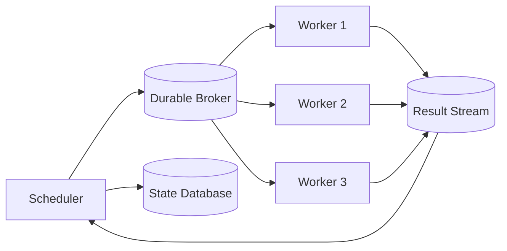

# Scaling

Scaling a multi-account orchestrator changes its failure model. The recommended path keeps component contracts stable while moving coordination boundaries only when required.

## Stage 1: Single Process

One process contains the scheduler and worker pool. SQLite stores state. This shape is easy to operate and appropriate for design validation or modest I/O-bound workloads. The in-memory account set enforces per-account serialization.

The limit is not a fabricated task-per-second number. The limit is reached when measured queue delay, resource use, recovery time, or availability no longer satisfies requirements.

## Stage 2: Durable Queue and Remote Workers

Workers move out of process when independent scaling, isolation, or deployment is needed. The broker provides durable delivery and backpressure. Task envelopes require schema versions, correlation IDs, and idempotency keys.

At-least-once delivery means a worker may see a task more than once. Consumers must deduplicate or make the remote effect idempotent.

## Stage 3: Multiple Schedulers

Multiple schedulers improve availability but require transactional task claims and account leases in shared state. An in-memory lock is no longer sufficient.

Partitioning by account ID can reduce lease contention because all tasks for one account route to the same scheduler shard. Rebalancing must avoid two shards believing they own the account simultaneously. Lease fencing remains necessary.

## Capacity Dimensions

Scale decisions should distinguish:

- queue ingestion rate;
- ready-task backlog and oldest-task age;
- worker utilization and execution latency;
- state-store claim and result-write latency;
- retry volume and retry amplification;
- active versus unhealthy accounts; and
- broker redelivery and dead-letter volume.

Throughput without queue-age and error metrics can hide starvation or a retry storm.

## Backpressure

The scheduler should claim only enough tasks to occupy known capacity. Workers should use bounded prefetch. Adapters should expose upstream capacity signals where permitted, and scheduler policies can reduce dispatch for a constrained adapter without stopping unrelated pools.

When the state database is unavailable, stop new dispatch rather than executing actions whose results cannot be recorded. Availability of execution without availability of durable state produces unrecoverable ambiguity.

## Partitioning

Account ID is a natural partition key because it preserves per-account ordering. Tenant ID may be added for isolation and quota enforcement. Workflow IDs should not be the only partition key because one account can have multiple workflows that must still respect the same account lease.

Cross-account workflows require special care. Prefer coordinator records and events rather than holding locks across partitions.

## Deployment Safety

Distributed upgrades introduce version skew. Task envelopes and results need backward-compatible schemas. Workers advertise supported task types and versions. Schedulers must not route unsupported work to them.

Use rolling deployment only when old and new versions can coexist. Database migrations should be expand-and-contract: add compatible fields, deploy readers/writers, backfill, and remove old fields later.

## Observability

Useful signals include:

- dispatch decisions by reason;
- claim conflicts and lease expirations;
- time in queue by priority;
- attempt duration and result category;
- retries scheduled and exhausted;
- account lifecycle transitions; and
- workflow step latency and failure position.

Trace context should follow task ID, workflow run ID, account ID, and attempt number, while excluding credentials and sensitive session data.

## Choosing Not to Distribute

Distributed systems add genuine operational cost. If a single scheduler meets measured requirements and recovery objectives, keeping it is a valid engineering choice. SocialFlow's boundaries allow later distribution; they do not require it prematurely.
