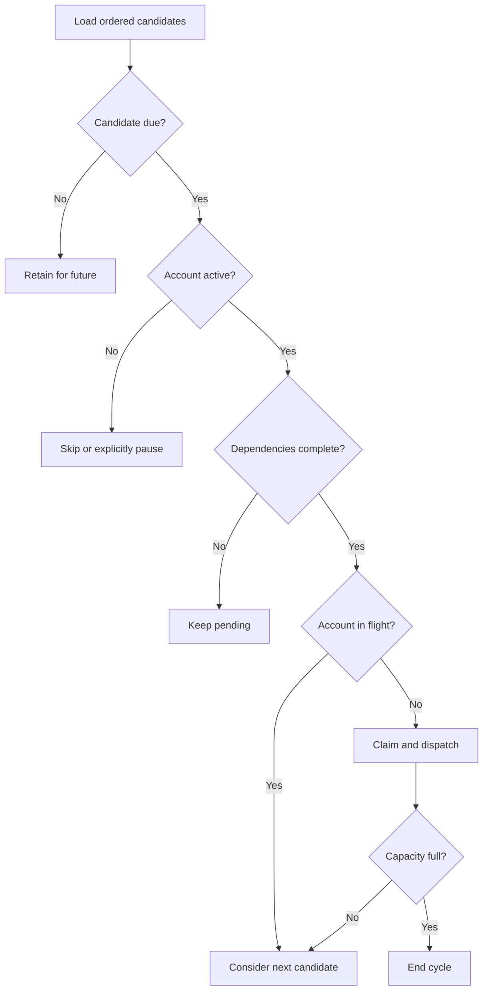

# Adaptive Scheduler

The scheduler converts queued intent into bounded, account-safe execution. It is adaptive because every cycle evaluates current time, account health, workflow dependencies, capacity, and in-flight ownership.

## Eligibility

A task is dispatchable only when all required predicates are true:

```text
status is PENDING or RETRY
scheduled_at <= scheduler_clock
account.status is ACTIVE
workflow dependencies are complete
account has no active task or lease
global worker capacity is available
```

Priority orders eligible candidates but does not override these predicates. A priority-1 task scheduled tomorrow must not prevent a ready priority-10 task from running today.

## Selection Cycle



The cycle should use one captured current time. Re-reading the clock for every candidate makes boundary behavior difficult to reproduce and test.

## Priority and Fairness

Lower numeric priority represents greater urgency. Within a priority, scheduled time and a stable insertion sequence provide deterministic order.

Pure priority scheduling can starve low-priority tasks. Several fairness policies can be introduced without changing workers:

- **Priority aging:** improve effective priority as waiting time grows.
- **Weighted account queues:** give accounts a defined share of dispatch opportunities.
- **Round-robin within a priority:** rotate between accounts before selecting a second task from one account.
- **Tenant quotas:** reserve or cap capacity for a group of accounts.

The correct policy depends on operational goals. SocialFlow does not claim that one fairness strategy fits every deployment; it identifies the scheduler as the boundary where the policy belongs.

## Account-Aware Concurrency

Global capacity and account capacity solve different problems. A global limit of ten protects worker resources. A per-account limit of one prevents two actions from racing against the same session, remote resource, or local state.

In a local scheduler, an `in_flight_accounts` set is sufficient. In a distributed scheduler, use a lease with:

- account ID;
- owner ID;
- acquired and expiration timestamps;
- monotonically increasing fencing token; and
- heartbeat timestamp for long tasks.

The fencing token prevents an old owner from writing a late result after its lease expired and another owner took over.

## Claim Before Dispatch

A task should transition to `RUNNING` and acquire its account lease in the same transaction before it is delivered to a worker. A conditional update can express the claim:

```sql
UPDATE tasks
SET status = 'running', owner_id = ?, lease_expires_at = ?
WHERE id = ? AND status IN ('pending', 'retry');
```

Exactly one scheduler should observe one affected row. Account leasing needs an equivalent conditional write.

## Result Processing

The scheduler, not the worker, interprets an `ExecutionResult` in global context:

- success produces `SUCCESS` and may unlock a workflow step;
- retryable failure with budget remaining produces `RETRY` and a next-attempt time;
- non-retryable or exhausted failure produces `FAILED`;
- final failure updates only the owning account to `NEEDS_ATTENTION` according to policy.

Execution history should be appended even if the task will retry. The current task record stores only the latest scheduling state.

## Clock and Backpressure

Use UTC for durable timestamps and a monotonic clock for measuring durations. Clock skew matters when leases cross machines, so distributed deployments should size lease margins accordingly.

When workers are saturated, the scheduler should stop claiming new tasks. A durable queue provides natural backpressure. Unbounded prefetch moves the backlog into worker memory and makes lease recovery harder.

## Service Loop

A scheduler service can combine event notification with periodic polling. Notification reduces latency; polling recovers missed signals. Empty cycles should back off, while new work or a completed result can wake the loop immediately.

The reference code in [`src/socialflow/reference_scheduler.py`](../src/socialflow/reference_scheduler.py) demonstrates selection only. It intentionally omits persistence, threads, and transport so the policy remains readable.
