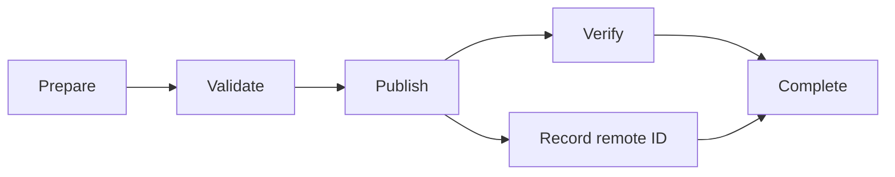
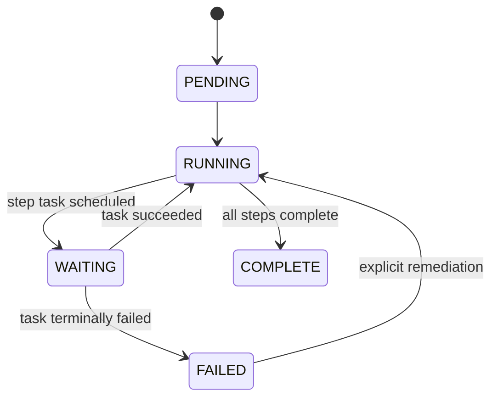

# Workflow Engine

The workflow engine organizes independent task attempts into an understandable business sequence. It answers which step is ready, which steps completed, and where execution stopped.

## Minimal Model

A workflow definition contains stable step IDs and dependencies. A workflow run binds that definition to one account and records progress.

```text
WorkflowDefinition
  id
  version
  steps[]

WorkflowRun
  id
  definition_id
  account_id
  current_step
  completed_steps[]
  failed_step
  status
```

Definitions should be versioned. Editing a definition in place while runs are active makes their persisted state ambiguous.

## Step Dependencies



A step is ready when all declared dependencies are complete and no workflow failure policy blocks it. A sequential workflow is simply a dependency graph where every step depends on the previous step.

The initial reference model avoids arbitrary code in conditions. Deterministic dependency records are easier to persist, inspect, migrate, and recover.

## Materializing Tasks

Workflow steps are not worker invocations. When a step becomes ready, the engine creates a task containing:

- workflow run and step IDs;
- account ID;
- task type and versioned payload;
- priority and scheduled time;
- retry budget; and
- a stable idempotency key.

Materialization should be idempotent. A unique constraint on workflow-run ID plus step ID prevents a scheduler restart from creating duplicate tasks for the same step.

## Processing Outcomes



Successful task completion marks its step complete and may unlock multiple dependents. Terminal failure records `failed_step` and blocks dependents. The workflow retains completed steps so recovery does not restart from the beginning.

The transition from task success to step completion and creation of newly ready tasks should be transactional. Otherwise, a crash may save success without materializing the next step.

## Failure Policy

The smallest useful policy stops a workflow at the first terminally failed step. More advanced policies include:

- continue independent branches;
- run a compensating step;
- wait for operator approval;
- skip an optional step; or
- retry the workflow step with a new task.

Each option adds persisted semantics. Compensation is not a database rollback; it is another fallible action that needs its own task, result, and recovery behavior.

## Concurrency Within a Workflow

Independent branches may be ready at the same time, but the account-level concurrency policy still applies. If an account permits only one task, branches execute serially even though their dependency graph allows parallelism. Workflow concurrency expresses possibility; scheduler policy controls actual dispatch.

## Versioning and Migration

Task payloads and workflow definitions need explicit versions. A worker should reject an unsupported version with a terminal, diagnosable result rather than guessing. Active workflow runs normally stay pinned to the definition version under which they started.

Migration is appropriate when a security or correctness issue makes the old definition unsafe. The migration should record source version, target version, transformed state, and operator reason.

## What the Initial Engine Omits

SocialFlow does not yet specify dynamic fan-out, calendars, human tasks, compensation DSLs, or visual editing. Those are valuable features, but they should be layered on a clear model of durable step readiness and outcomes rather than added as in-memory control flow.
