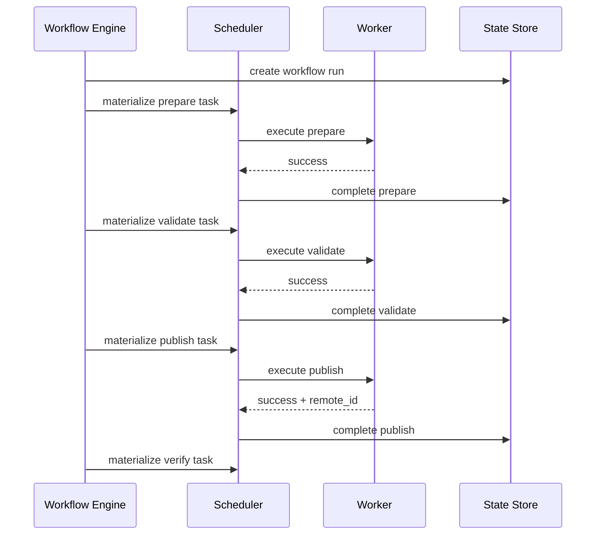

# Basic Workflow

This example follows one account through a small, sequential workflow. It is a state-transition example, not a platform integration.

## Definition

```yaml
workflow_id: publish-and-verify
version: 1
account_id: account-001
steps:
  - id: prepare
    task_type: prepare_content
  - id: validate
    task_type: validate_policy
    depends_on: [prepare]
  - id: publish
    task_type: publish_content
    depends_on: [validate]
  - id: verify
    task_type: verify_remote_result
    depends_on: [publish]
```



## Durable Progress

After the publish step succeeds, the run might contain:

```json
{
  "id": "run-42",
  "workflow_id": "publish-and-verify",
  "workflow_version": 1,
  "account_id": "account-001",
  "status": "running",
  "completed_steps": ["prepare", "validate", "publish"],
  "current_step": "verify",
  "failed_step": null
}
```

If the scheduler restarts at this point, it does not repeat preparation or publishing. It recreates or reloads the task for `verify`, subject to idempotent materialization.

## Important Properties

- Every step is independently executable.
- The workflow definition is versioned.
- The publish task carries a stable idempotency key.
- The remote operation ID is stored as execution metadata, not treated as scheduler policy.
- Task success and step completion are persisted before the next step is created.
- Credentials are resolved by the worker adapter and never stored in this definition.

For dependency and failure semantics, see [Workflow Engine](../docs/workflow-engine.md).
