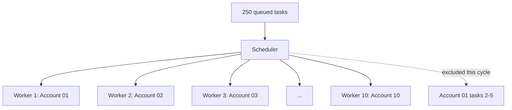

# Multi-Account Scheduling

This scenario models 50 accounts, five tasks per account, and a global capacity of ten workers. It demonstrates account-aware selection and failure isolation without claiming a throughput benchmark.

## Initial State

```text
accounts:             50 ACTIVE
tasks:                250 PENDING
tasks per account:    5
global concurrency:   10
per-account limit:    1
```

Tasks use priorities 10, 20, 30, 40, and 50 within each account. The queue therefore contains many tasks with equal priority. A stable account-aware selection policy chooses no more than one task from an account in a dispatch cycle.



## First Dispatch Cycle

The scheduler:

1. loads ready priority-10 candidates;
2. verifies that their accounts are active;
3. selects ten distinct account IDs;
4. persists ten task claims and ten account leases; and
5. dispatches ten task envelopes.

Assume the results are:

| Account | Result | Scheduler action |
| --- | --- | --- |
| 01-07 | Success | Mark task successful |
| 08 | Temporary timeout | Schedule bounded retry |
| 09 | Invalid task payload | Final task failure, account needs attention |
| 10 | Success | Mark task successful |

## Failure Isolation

Account 09 moves to `NEEDS_ATTENTION`. Its remaining tasks become ineligible. The scheduler does not stop and does not mark Accounts 01-08 or 10 unhealthy.

The retry for Account 08 receives a future `next_attempt_at`. It is not selected again until that time, so it does not occupy a worker while waiting.

## Second Dispatch Cycle

Capacity becomes available. The scheduler considers the global priority order again, skipping:

- Account 08's retry because it is scheduled in the future;
- Account 09 because the account is not active; and
- any account that still owns an active lease.

It fills capacity from other active accounts. The exact account order depends on the configured fairness policy; SocialFlow does not invent a timing or throughput result for this scenario.

## State Snapshot

```json
{
  "account_08": {
    "status": "active",
    "current_task": "retry",
    "next_attempt_at": "2026-08-31T09:01:30Z"
  },
  "account_09": {
    "status": "needs_attention",
    "last_failure": "2026-08-31T09:00:04Z",
    "failed_tasks": 1
  },
  "account_10": {
    "status": "active",
    "last_success": "2026-08-31T09:00:05Z"
  }
}
```

## What This Demonstrates

- global concurrency and per-account serialization are independent;
- priority is filtered through account and schedule eligibility;
- retry waiting does not consume worker capacity;
- one terminal failure affects one account; and
- durable state explains every scheduling decision after a restart.

See [Adaptive Scheduler](../docs/scheduler.md) for the selection algorithm.
