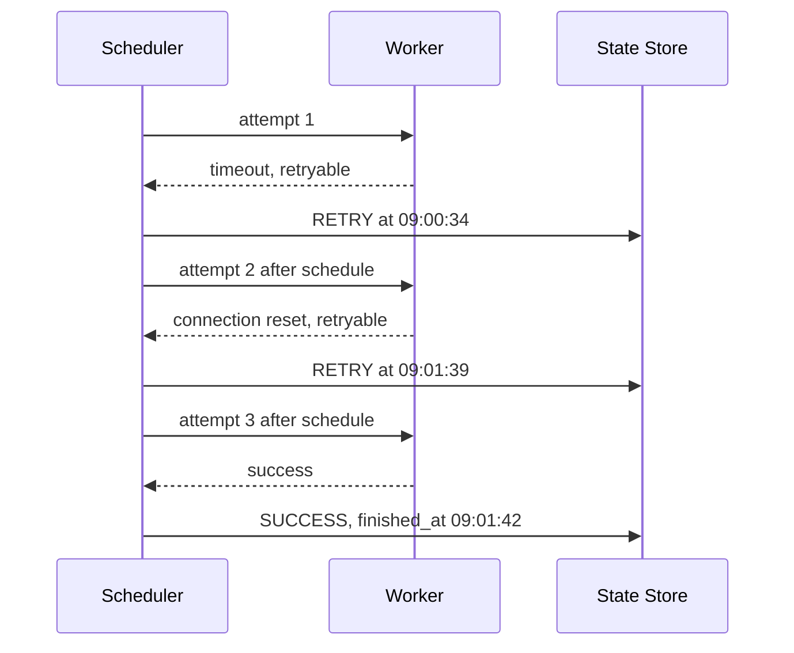
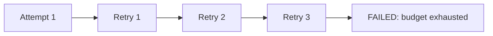

# Retry Strategy

This example defines a bounded retry policy for transient worker failures. It distinguishes an attempt result from the final task state.

## Policy

```yaml
max_retries: 3
base_delay_seconds: 30
max_delay_seconds: 900
jitter_seconds: 10
retryable_categories:
  - transport_timeout
  - connection_reset
  - upstream_capacity
terminal_categories:
  - invalid_payload
  - unsupported_task_version
  - permission_denied
```

`max_retries: 3` means one initial attempt plus at most three retries. Infinite retry is not supported.

## Timeline



The execution history retains all three attempts:

| Attempt | Result | Retryable | Resulting task state |
| --- | --- | --- | --- |
| 1 | transport timeout | yes | `RETRY` |
| 2 | connection reset | yes | `RETRY` |
| 3 | success | n/a | `SUCCESS` |

## Exhausted Retry

If attempt four had failed with a retryable category, the retry budget would be exhausted. The scheduler would set the task to `FAILED`, record `finished_at` and the final error, and apply the account-health policy.



## Jitter

When many accounts fail together, deterministic exponential backoff can produce synchronized retry waves. Adding random jitter spreads next-attempt times across a small window. The selected jitter value should be persisted as part of `next_attempt_at`; recomputing it after restart changes ordering.

## Retry-After Hints

A permitted upstream API may provide a retry-after duration. The adapter can return it as result metadata. The scheduler validates the hint against minimum and maximum policy bounds before using it. The worker does not sleep and retry internally because that would consume capacity and hide the attempt from durable state.

See [Failure Recovery](../docs/failure-recovery.md) for leases, idempotency, and dead-letter handling.
